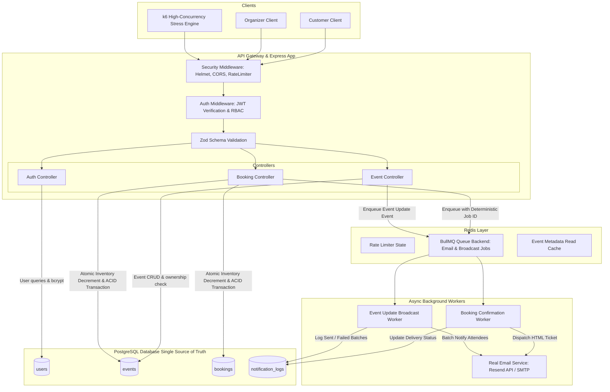
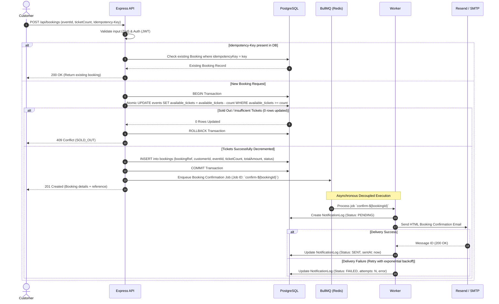

# Final System Architecture & Technical Design Blueprint (V2 — Production Specification)

---

## 1. Locked Technology Stack & Core Decisions

| Component | Technology | Rationale & Architectural Purpose |
|---|---|---|
| **Runtime & Language** | Node.js (v18+) & TypeScript | Strict type safety, clean asynchronous I/O, modern backend ecosystem |
| **API Framework** | Express.js | Robust, lightweight REST API framework with well-tested middleware ecosystem |
| **Database & ORM** | **PostgreSQL** + **Prisma ORM** | ACID transactions, row-level locking (`SELECT FOR UPDATE`), atomic conditional updates, strict relational integrity |
| **In-Memory Store** | **Redis** (ioredis / Upstash / local) | Queue backend for BullMQ, rate limiting, and optional read metadata cache |
| **Async Worker Queue** | **BullMQ** | Dedicated background job queues with automatic exponential backoff retries, concurrency controls, and deterministic job IDs |
| **Email Delivery** | **Resend API** / **Nodemailer SMTP** | Real HTML transactional email delivery for booking confirmations & event update broadcasts |
| **Validation & Security** | **Zod**, **bcryptjs**, **jsonwebtoken**, **Helmet**, **CORS** | Strict runtime schema validation, password hashing, JWT RBAC, secure HTTP headers |
| **Stress Testing** | **k6** (with custom scenarios) | Quantifiable high-concurrency load testing, threshold evaluations (p95/p99 latency, RPS, 0% overselling verification) |

---

## 2. Final High-Level Architecture Diagram



---

## 3. Production PostgreSQL Database Schema (Prisma)

```prisma
datasource db {
  provider = "postgresql"
  url      = env("DATABASE_URL")
}

generator client {
  provider = "prisma-client-js"
}

enum Role {
  ORGANIZER
  CUSTOMER
}

enum EventStatus {
  UPCOMING
  ONGOING
  COMPLETED
  CANCELLED
}

enum BookingStatus {
  CONFIRMED
  CANCELLED
}

enum NotificationType {
  BOOKING_CONFIRMATION
  EVENT_UPDATE
}

enum DeliveryStatus {
  PENDING
  SENT
  FAILED
}

model User {
  id           String    @id @default(uuid())
  email        String    @unique
  passwordHash String    @map("password_hash")
  fullName     String    @map("full_name")
  role         Role      @default(CUSTOMER)
  createdAt    DateTime  @default(now()) @map("created_at")
  updatedAt    DateTime  @updatedAt @map("updated_at")

  events       Event[]
  bookings     Booking[]

  @@map("users")
}

model Event {
  id               String      @id @default(uuid())
  organizerId      String      @map("organizer_id")
  title            String
  description      String      @db.Text
  category         String
  location         String
  onlineLink       String?     @map("online_link")
  eventDate        DateTime    @map("event_date")
  totalCapacity    Int         @map("total_capacity")
  availableTickets Int         @map("available_tickets")
  ticketPrice      Decimal     @map("ticket_price") @db.Decimal(10, 2)
  status           EventStatus @default(UPCOMING)
  createdAt        DateTime    @default(now()) @map("created_at")
  updatedAt        DateTime    @updatedAt @map("updated_at")

  organizer        User        @relation(fields: [organizerId], references: [id], onDelete: Cascade)
  bookings         Booking[]
  notificationLogs NotificationLog[]

  @@index([organizerId])
  @@index([eventDate])
  @@index([category])
  @@index([status])
  @@map("events")
}

model Booking {
  id               String        @id @default(uuid())
  bookingReference String        @unique @map("booking_reference")
  idempotencyKey   String?       @unique @map("idempotency_key")
  customerId       String        @map("customer_id")
  eventId          String        @map("event_id")
  ticketCount      Int           @map("ticket_count")
  totalAmount      Decimal       @map("total_amount") @db.Decimal(10, 2)
  status           BookingStatus @default(CONFIRMED)
  createdAt        DateTime      @default(now()) @map("created_at")
  updatedAt        DateTime      @updatedAt @map("updated_at")

  customer         User          @relation(fields: [customerId], references: [id], onDelete: Cascade)
  event            Event         @relation(fields: [eventId], references: [id], onDelete: Cascade)
  notificationLogs NotificationLog[]

  @@index([customerId])
  @@index([eventId])
  @@index([status])
  @@map("bookings")
}

model NotificationLog {
  id                String           @id @default(uuid())
  eventId           String           @map("event_id")
  bookingId         String?          @map("booking_id")
  recipientEmail    String           @map("recipient_email")
  notificationType  NotificationType @map("notification_type")
  deliveryStatus    DeliveryStatus   @default(PENDING) @map("delivery_status")
  attempts          Int              @default(0)
  providerMessageId String?          @map("provider_message_id")
  errorMessage      String?          @map("error_message") @db.Text
  createdAt         DateTime         @default(now()) @map("created_at")
  sentAt            DateTime?        @map("sent_at")

  event             Event            @relation(fields: [eventId], references: [id], onDelete: Cascade)
  booking           Booking?         @relation(fields: [bookingId], references: [id], onDelete: SetNull)

  @@index([eventId])
  @@index([bookingId])
  @@index([deliveryStatus])
  @@map("notification_logs")
}
```

---

## 4. Concurrency Control & Atomic Booking Algorithm

### 4.1 The Core Atomic Operation
To achieve absolute consistency and zero overselling under intense concurrent flash-sale load without deadlocks:

```typescript
// Inside PostgreSQL transaction
const updatedRows = await prisma.$executeRaw`
  UPDATE events 
  SET available_tickets = available_tickets - ${ticketCount},
      updated_at = NOW()
  WHERE id = ${eventId} 
    AND available_tickets >= ${ticketCount}
    AND status = 'UPCOMING'::"EventStatus"
`;

if (updatedRows === 0) {
  // Either not enough tickets or event is not UPCOMING
  throw new AppError('SOLD_OUT', 409, 'Not enough tickets available for this event.');
}
```

### 4.2 End-to-End Booking Sequence



---

## 5. Cancellation & Inventory Restoration Safeguard

To prevent double-restoring ticket capacity if a user clicks cancel repeatedly:
```typescript
await prisma.$transaction(async (tx) => {
  // 1. Lock the booking record
  const booking = await tx.booking.findUnique({
    where: { id: bookingId }
  });

  if (!booking || booking.customerId !== userId) {
    throw new AppError('NOT_FOUND', 404, 'Booking not found');
  }

  if (booking.status !== 'CONFIRMED') {
    throw new AppError('ALREADY_CANCELLED', 400, 'Booking is already cancelled');
  }

  // 2. Mark booking as CANCELLED atomically
  await tx.booking.update({
    where: { id: bookingId },
    data: { status: 'CANCELLED' }
  });

  // 3. Atomically restore event ticket capacity
  await tx.event.update({
    where: { id: booking.eventId },
    data: {
      availableTickets: {
        increment: booking.ticketCount
      }
    }
  });
});
```

---

## 6. Background Queue Engine Architecture

### 6.1 Booking Confirmation Email Job (`bookingQueue`)
- **Deterministic Job ID**: `confirm-${booking.id}` (ensures BullMQ deduplicates any redundant attempts)
- **Retry Strategy**: 3 attempts with exponential backoff (`delay: 2000`, `backoff: 'exponential'`)
- **Template**: Branded HTML E-Ticket with booking reference, seat count, total amount, event date/venue.

### 6.2 Event Update Broadcast Notification (`broadcastQueue`)
- **Trigger**: Organizer executes `PUT /api/events/:id` modifying `eventDate`, `location`, or `title`.
- **Batch Processing**:
  1. Worker fetches all distinct customers with active `CONFIRMED` bookings for the updated event.
  2. Splits recipients into controlled batches (e.g. 20 recipients per chunk) to avoid provider rate limiting.
  3. Dispatches notifications informing customers of the critical update.
  4. Records dispatch logs into `notification_logs`.

---

## 7. Stress Testing & Concurrency Benchmark Strategy

### 7.1 The k6 Flash-Sale Script Scenario
- **Event Capacity**: Exactly 100 tickets.
- **Concurrent Virtual Users**: 500 VUs firing simultaneously within a 10s window.
- **Payloads**: Randomized ticket quantities (1 to 4 tickets per request).

### 7.2 Core Metrics to Benchmark & Measure
1. **Concurrency Correctness**:
   - Total Tickets Sold $\le$ Total Capacity (Target: Exactly 100 tickets sold, **0 overselling**).
   - Expected HTTP Statuses: Combination of `201 Created` (successful bookings) and `409 Conflict` (sold out).
   - Infrastructure Failure Rate: $0\%$ (5xx Server Errors).
2. **Throughput (RPS)**: Measured requests processed per second under peak load.
3. **Latency**: p50, p90, p95, and p99 response times.
4. **Queue Processing Time**: Time from booking creation to email delivery completion in background.

*(All final quantitative metrics will be populated using actual measurements from our live k6 benchmark runs.)*

---

## 8. Security & Role-Based Authorization Matrix

| Endpoint | Method | Role Allowed | Ownership Check |
|---|---|---|---|
| `/api/auth/register` | `POST` | Public | None |
| `/api/auth/login` | `POST` | Public | None |
| `/api/auth/me` | `GET` | Authenticated | Current user |
| `/api/events` | `GET` | Public | None (Active events only) |
| `/api/events/:id` | `GET` | Public | None |
| `/api/events` | `POST` | `ORGANIZER` | Set `organizerId = req.user.id` |
| `/api/events/:id` | `PUT` | `ORGANIZER` | `event.organizerId === req.user.id` |
| `/api/events/:id` | `DELETE` | `ORGANIZER` | `event.organizerId === req.user.id` |
| `/api/events/:id/attendees` | `GET` | `ORGANIZER` | `event.organizerId === req.user.id` |
| `/api/bookings` | `POST` | `CUSTOMER` | Concurrency-protected booking |
| `/api/bookings/my` | `GET` | `CUSTOMER` | Returns customer's bookings only |
| `/api/bookings/:id` | `GET` | `CUSTOMER` / `ORGANIZER` | Customer owns booking OR Organizer owns event |
| `/api/bookings/:id/cancel` | `POST` | `CUSTOMER` | `booking.customerId === req.user.id` |
