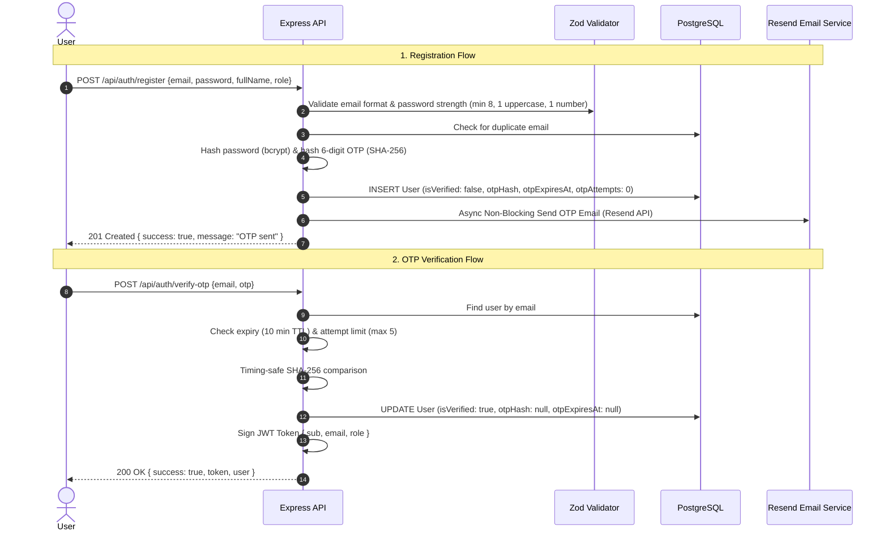

# Phase 2: Authentication, JWT, RBAC & OTP Email Verification - IMPLEMENTED ✅

## 1. Overview & Status

Phase 2 is **fully implemented and verified with 100% test pass rate (21/21 tests)**.

### Key Implemented Features
- **User Registration (`POST /api/auth/register`)**: Supports `CUSTOMER` and `ORGANIZER` roles, bcrypt password hashing (10 rounds), generates a 6-digit cryptographic OTP, hashes it with SHA-256 in PostgreSQL, and dispatches the OTP email via Resend asynchronously.
- **Hashed OTP Storage**: Raw OTPs are **never** stored in plain text. SHA-256 hashes are verified using timing-safe comparisons (`crypto.timingSafeEqual`).
- **OTP Attempt Protection**: Limits verification to **5 attempts per OTP**. Attempt counter is incremented on failed attempts and reset upon successful verification or resend.
- **Resend OTP (`POST /api/auth/resend-otp`)**: Generates fresh 6-digit OTP, invalidates previous hash, resets attempts to 0, grants fresh 10-minute TTL, and dispatches new email.
- **Account Verification (`POST /api/auth/verify-otp`)**: Validates OTP hash, marks `isVerified = true`, cleans up `otpHash` and `otpExpiresAt`, and issues a signed JWT token.
- **Login (`POST /api/auth/login`)**: Verifies bcrypt password, enforces `isVerified === true`, and issues JWT with payload `{ sub, email, role }`.
- **RBAC & Authentication Middleware**: `authenticate` middleware verifies Bearer token; `requireRole` middleware enforces role boundaries (`CUSTOMER` vs `ORGANIZER`).
- **Rate Limiting (`authRateLimit`)**: Strict rate limiting applied to `/api/auth/*` endpoints.
- **Standardized Error Handling**: Unified error response `{ success: false, error: { code, message, details? } }`.

---

## 2. API Endpoints Specification & Verification Status

| Method | Endpoint | Access | Description | Status |
|---|---|---|---|---|
| `POST` | `/api/auth/register` | Public | Register account, hash password & OTP, send email | ✅ Verified (201) |
| `POST` | `/api/auth/verify-otp` | Public | Verify OTP hash, activate account, return JWT | ✅ Verified (200) |
| `POST` | `/api/auth/resend-otp` | Public | Resend fresh OTP, reset attempts, reset TTL | ✅ Verified (200) |
| `POST` | `/api/auth/login` | Public | Authenticate credentials, verify status, return JWT | ✅ Verified (200) |
| `GET` | `/api/auth/me` | Bearer Auth | Return current authenticated user profile | ✅ Verified (200) |

---

## 3. Data Flow & Security Architecture

---

## 4. Test Suite Summary

- **Test Suite**: `tests/auth.test.ts` (11 unit & integration tests)
- **Total Suite Passing**: 21 / 21 tests across 5 files (`auth.test.ts`, `database.test.ts`, `swagger.test.ts`, `middleware.test.ts`, `health.test.ts`)
