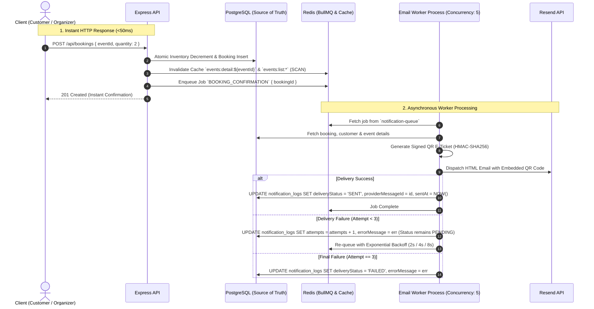

# Phase 4: BullMQ Worker Queue, Redis Caching, QR E-Tickets & Notifications

## 1. Overview & Core Architectural Guarantees

Phase 4 implements a decoupled distributed processing architecture:
- **Zero Email Latency on API Requests**: User registration, OTP resend, and booking endpoints enqueue jobs into BullMQ and return immediate HTTP responses (<50ms). Email dispatch occurs entirely in the background.
- **Dedicated Worker Service (`src/workers/emailWorker.ts`)**: Runs with `concurrency: 5`, exponential backoff retry logic (3 attempts: 2s, 4s, 8s), and graceful termination handling.
- **Signed QR Code E-Tickets**: Generates scannable QR code PNGs containing a cryptographically signed HMAC-SHA256 payload to guarantee ticket authenticity.
- **Batched Event Broadcast Engine**: When critical event details change (`title`, `eventDate`, `location`, `onlineLink`), all `CONFIRMED` attendees are queried and queued in batches to prevent email provider rate-limit exhaustion.
- **Accurate Notification Tracking**: PostgreSQL `NotificationLog` captures `attempts`, `providerMessageId`, `errorMessage`, and only marks `FAILED` after the 3rd final retry is exhausted.
- **Non-Blocking Redis Caching (`SCAN`)**: Read-through caching for event discovery with event-driven invalidation using non-blocking Redis `SCAN`. PostgreSQL remains the single source of truth for all transactional booking operations.

---

## 2. Distributed Queue & Worker Architecture



---

## 3. BullMQ Job Types & Payload Specifications

### Queue Name: `notification-queue`

| Job Name | Triggering Event | Job Payload | Worker Action |
|---|---|---|---|
| `AUTH_OTP` | Registration or Resend OTP | `{ email, fullName, otp }` | Sends 6-digit verification code HTML email |
| `BOOKING_CONFIRMATION` | Successful ticket booking | `{ bookingId }` | Fetches details, creates signed QR e-ticket, dispatches confirmation email |
| `EVENT_UPDATE_BROADCAST` | Organizer updates critical event field | `{ eventId, recipientEmail, recipientName, changedFields }` | Sends event update notification to confirmed attendee |

### Retry & Retention Configuration
```typescript
export const DEFAULT_JOB_OPTIONS = {
  attempts: 3,
  backoff: {
    type: 'exponential',
    delay: 2000, // 2s, 4s, 8s
  },
  removeOnComplete: {
    age: 3600, // 1 hour
    count: 1000,
  },
  removeOnFail: {
    age: 86400 * 3, // 3 days
    count: 5000,
  },
};
```

---

## 4. Cryptographically Signed QR Code E-Ticket Specification

### 1. Payload Structure
```json
{
  "ref": "ckz1234567890",
  "eventId": "e9b422a1-06cb-4a1d-84e3-519001b97b0d",
  "tickets": 2,
  "holder": "Alice Walker",
  "sig": "5a4f78e... (HMAC-SHA256 signature)"
}
```

### 2. Signature Generation & Verification Algorithm
- Signature Input: `${ref}:${eventId}:${tickets}:${holder}`
- Key: `JWT_SECRET`
- Algorithm: `HMAC-SHA256`
- Verification Helper: `verifyQrPayload(payload)` verifies signature matches data; rejects tampered tickets.
- Rendering: Generated via `qrcode.toDataURL(jsonString)` as a Data URI PNG and embedded into the confirmation email.

---

## 5. Batched Event Update Broadcast Engine

When an organizer updates any of the following critical fields:
- `title`
- `eventDate`
- `location`
- `onlineLink`

### Broadcast Workflow:
1. Detect field differences: `changedFields = ['title', 'eventDate']`.
2. Query only `CONFIRMED` attendees (excluding `CANCELLED` bookings):
   ```typescript
   const bookings = await prisma.booking.findMany({
     where: { eventId, status: BookingStatus.CONFIRMED },
     include: { customer: true },
   });
   ```
3. Split attendees into batches of **50 recipients**:
4. Enqueue `EVENT_UPDATE_BROADCAST` jobs into BullMQ.
5. BullMQ distributes jobs across worker concurrency threads without overloading email provider rate limits.

---

## 6. Redis Caching & Invalidation Strategy

### 1. Cache Keys & TTLs
- `events:list:<md5-query-hash>`: TTL = **60 seconds**
- `events:detail:<eventId>`: TTL = **30 seconds**

### 2. Invalidation Mechanics (Non-Blocking `SCAN`)
- Helper: `invalidateEventCache(eventId)`
  - Deletes `events:detail:<eventId>`.
  - Uses `redis.scanStream({ match: 'events:list:*' })` to safely identify and delete matching list cache keys without blocking the Redis event loop.

### 3. Invalidation Triggers
| Event Occurred | Invalidation Action |
|---|---|
| Event Created | Invalidate `events:list:*` |
| Event Updated | Invalidate `events:detail:<id>` and `events:list:*` |
| Event Cancelled | Invalidate `events:detail:<id>` and `events:list:*` |
| Booking Confirmed | Invalidate `events:detail:<id>` (ticket count updated) |
| Booking Cancelled | Invalidate `events:detail:<id>` (ticket count updated) |

---

## 7. Phase 4 Automated Test Matrix (20 Tests)

### Queue & Worker Tests (`tests/queue.test.ts` - 6 Tests)
- `TC-QUEUE-01`: Producer enqueues `AUTH_OTP` job into BullMQ.
- `TC-QUEUE-02`: Producer enqueues `BOOKING_CONFIRMATION` job into BullMQ.
- `TC-QUEUE-03`: Worker successfully processes booking confirmation and dispatches email.
- `TC-QUEUE-04`: Failed delivery triggers exponential backoff retry (up to 3 attempts).
- `TC-QUEUE-05`: `NotificationLog` is marked `FAILED` only after final retry is exhausted.
- `TC-QUEUE-06`: Successful email delivery updates `NotificationLog` status to `SENT` with `providerMessageId`.

### QR Code & Signature Tests (`tests/qr.test.ts` - 4 Tests)
- `TC-QR-01`: Generates valid Data URI Base64 PNG QR code.
- `TC-QR-02`: QR payload contains booking reference, eventId, tickets, and holder.
- `TC-QR-03`: QR payload HMAC-SHA256 signature passes verification.
- `TC-QR-04`: Tampered or modified QR payload fails signature verification.

### Event Broadcast Tests (`tests/broadcast.test.ts` - 4 Tests)
- `TC-BROADCAST-01`: Critical field update (title, date, venue) triggers broadcast jobs.
- `TC-BROADCAST-02`: Non-critical field update (description) does not trigger broadcast jobs.
- `TC-BROADCAST-03`: Broadcast jobs are created only for `CONFIRMED` attendees.
- `TC-BROADCAST-04`: `CANCELLED` bookings are strictly excluded from broadcast list.

### Redis Caching Tests (`tests/cache.test.ts` - 6 Tests)
- `TC-CACHE-01`: First request triggers DB query (Cache Miss).
- `TC-CACHE-02`: Second request returns cached payload (Cache Hit).
- `TC-CACHE-03`: Updating event invalidates `events:detail:<id>` cache.
- `TC-CACHE-04`: Booking a ticket invalidates `events:detail:<id>` cache.
- `TC-CACHE-05`: Cancelling booking invalidates `events:detail:<id>` cache.
- `TC-CACHE-06`: Redis cache key cleanup uses non-blocking `SCAN` cursor.
